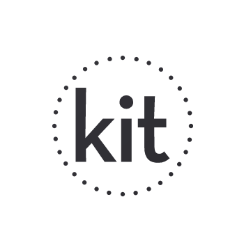

## Build the interesting stuff.

Kit's more or less an abstraction layer on top of some sensible Node choices.  The node ecosystem is great, but the common patterns in every node deploy can be knit together cohesively.

There's no real need to create something new here, so much as there is a need to put it together in a renewable way.

Kit is here to provide you with sensible configurations of your service layer, so that you can focus on creating a great product.

* Create an API server with common features out of the box, with your own CLI for free.
* Versioning, deploy, rollback and clustering abilities with no hassle.

## Installation

* `npm i -g kit-cli`
* `kit-cli init an-incredible-idea`
* `cd an-incredible-idea`
* `yarn dev`

## Add features

* `yarn add-feature auth roles subscriptions messages clustering`

## Version

* `yarn bump minor | major | patch`

## Deploy

* `yarn stage [--dry-run]`
* `yarn deploy [--dry-run]`
* `yarn rollback [--steps X]`

## Does it exist?

Nope, not at all.
